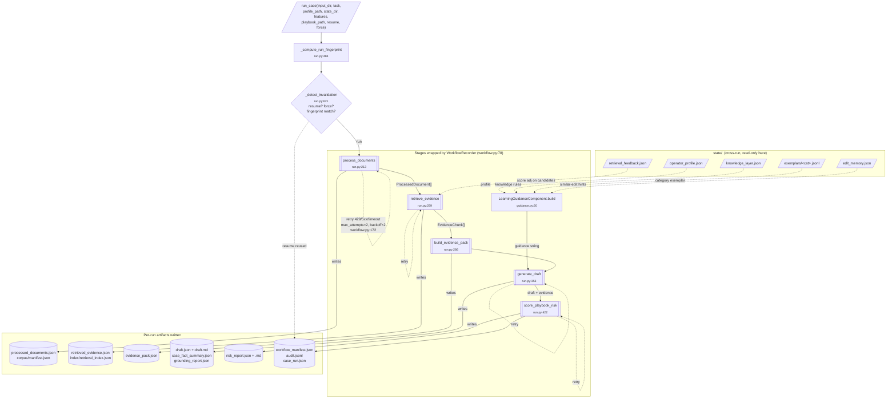
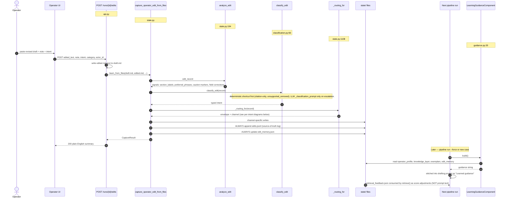
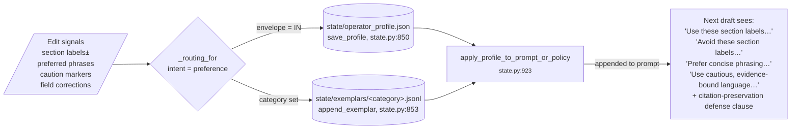
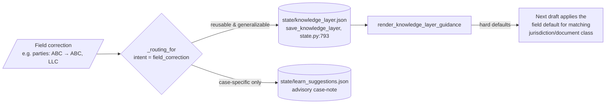
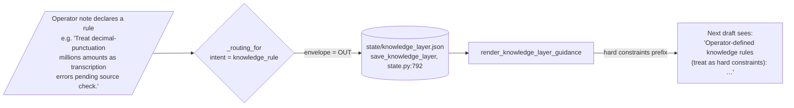
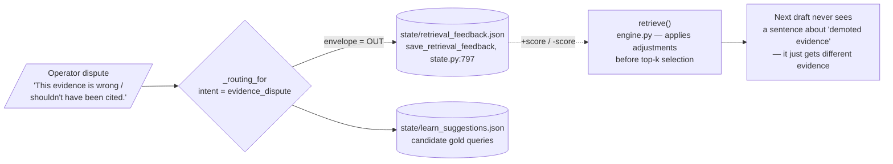
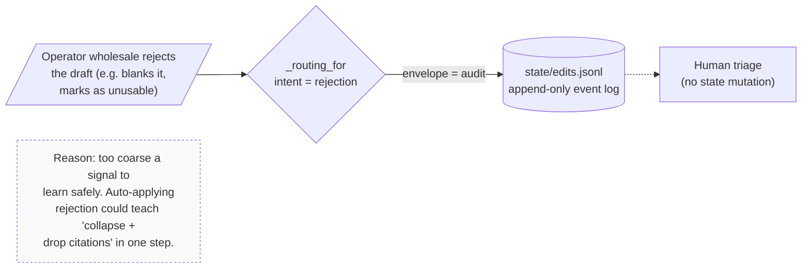

# Architecture Overview

OpenAI-core pipeline, with optional Cohere reranking, that turns messy
legal-style files into grounded draft memos designed for human operator
review and editing. The workflow
is linear at the orchestration level, but the implementation is grouped
by pipeline stage under `src/pipeline/<stage>/`. Every stage writes
an inspectable JSON artifact, optional behavior is controlled by
`PipelineFeatures`, and grounding is enforced at the draft stage with a
verbatim substring check plus advisory claim-support warnings. The durable
resources are explicit: corpus store, hybrid retrieval index, edit memory,
and evaluation harness artifacts.

## Visual Flows

Two diagrams cover the two real runtime concerns: the **orchestration**
layer (how a single case run executes — fingerprint, retries, the four
stage components, and where state is read from) and the
**learning-from-edits** flow (how an operator edit reshapes the next
draft). There is no separate "agent" layer in this build — LLM calls
sit inside the orchestration stages and the grounding contract is
enforced by a deterministic post-LLM validator, not by a model loop.
The harness (`src/pipeline/evaluation/harness.py`) is a small
deterministic gate utility on top of the orchestration outputs, not a
separate layer.

### 1. Orchestration — `run_case()` lifecycle



A run is a fingerprinted state transition. The fingerprint hashes
`(input file digests, task, profile digest, playbook digest, providers,
features)`. Stale checkpoints get invalidated per-stage. Every stage
writes an inspectable artifact and an `audit.jsonl` event;
`retrieval_feedback.json` is the only piece of `state/` that's not
prompt text — it's consumed by `retrieve()` as score adjustments on
candidate chunks.

### 2. Learning from operator edits

One master flow that all five edit channels share, then a focused
diagram per channel showing exactly what state gets written and how it
changes the next draft.

#### 2a. Master submit-to-next-draft flow



`actor_type != "human"` short-circuits to envelope `advisory` (no
state writes; human triage required) — see `_routing_for` at
`state.py:1112`.

#### 2b. `preference` — IN envelope, reshape drafter persona



Tone, section labels, and reusable phrasing. The renderer **always
appends** a citation-preservation clause so a terse "shorten this"
edit can never teach the drafter to drop citations from a still-stated
factual claim.

#### 2c. `field_correction` — IN envelope, fact defaults



Reusable corrections become knowledge-layer defaults. Case-specific
ones stay advisory so they don't pollute unrelated cases.

#### 2d. `knowledge_rule` — OUT envelope, hard constraint



Out-of-envelope: changes facts/rules, not persona or retrieval scores.
The rule text is injected verbatim into the drafting prompt under a
"hard constraints" header.

#### 2e. `evidence_dispute` — OUT envelope, retrieval reweight



The **only** channel that isn't prompt text. `retrieve()` consumes the
feedback as `+score` / `-score` deltas on candidate chunks, so disputed
evidence falls out of the top-k before the drafter is even called.

#### 2f. `rejection` — audit only, never auto-applies



Rejections are logged but **never** auto-mutate `operator_profile.json`,
`knowledge_layer.json`, or `retrieval_feedback.json`. They wait for
human triage. This is a deliberate guardrail against runaway terse-edit
collapse.

## Roles and Feedback Channels

The operator is a human legal-ops reviewer, paralegal, case analyst, or
attorney reviewer. AI components assist the operator by extracting text,
retrieving evidence, drafting, validating citations, and proposing review
flags. They are not the authority for reusable preference learning unless a
human accepts their proposed edit or annotation.

Operator edits are typed events. Each captured event carries an `intent`
field — five substantive kinds plus an `auto` resolver — and routes into
exactly one of four persistence channels based on an in-envelope /
out-of-envelope split:

| Intent | Envelope | Channel | What changes |
|---|---|---|---|
| `preference` | in | `state/operator_profile.json` + per-category exemplar | drafter persona: section labels, tone, phrasing |
| `field_correction` | in | `state/knowledge_layer.json` (reusable labels) | jurisdiction-class field defaults |
| `knowledge_rule` | out | `state/knowledge_layer.json` | extrinsic hard constraints |
| `evidence_dispute` | out | `state/retrieval_feedback.json` | retrieval demotes + candidate gold queries |
| `rejection` | audit | `edits.jsonl` only | wholesale rejection (too coarse to auto-learn) |

In-envelope edits change the *drafter's persona* — what shape and tone
future drafts take. Out-of-envelope edits change *facts and retrieval* —
what evidence the drafter sees and what hard rules constrain it. The
distinction matters at the rubric level: a single terse operator edit
can teach "collapse + drop citations" if every signal is bundled into one
profile blob, but the typed routing forces caution-tone signals
(in-envelope) and factual constraints (out-of-envelope) into separate
state files with different downstream consumers.

Every captured edit is also appended to `outputs/<case>/edits.jsonl` and,
when `--state-dir` is given, to `state/edits.jsonl`. The log is the
source-of-truth event stream; the channel files are derived state.

The pipeline composes the drafter's `learned_guidance` by concatenating:

1. **operator_profile.json** → `apply_profile_to_prompt_or_policy` produces
   a concise prompt suffix covering section labels, preferred phrases,
   caution markers, and a non-negotiable citation-preservation clause.
2. **knowledge_layer.json** → `render_knowledge_layer_guidance` produces a
   short "treat as hard constraints" block listing rules + field
   defaults.
3. **state/exemplars/<category>.jsonl** → at draft time the pipeline
   determines the dominant retrieved-document category and pulls the most
   recent matching exemplar (added section labels, opening of operator's
   memo, preferred phrases) into the prompt as a few-shot.
4. **retrieval_feedback.json** → retrieval consumes evidence boosts/demotes
   as auditable score adjustments before candidate selection, and the same
   disputes remain available for gold promotion.

Three feedback families still apply across the channels:

- **Grounding/factuality** comes from deterministic validators first and
  human-approved annotations second. It updates warnings, eval artifacts,
  gold labels, retrieval/extraction fixes, or case-level records.
- **Preference/style/structure** comes from human operator edits routed as
  `preference` or `field_correction`.
- **AI critique** is advisory. It can propose unsupported-claim or
  citation issues for review, but it does not directly update the profile
  or gold labels until a human accepts.

Learned guidance may influence wording and organization. It must never weaken
citation ids, verbatim quote checks, unsupported-fact routing, or
claim-citation reporting.

In this design, "future results" means later pipeline outputs and metrics:
future `draft.md` / `draft.json` artifacts, selected evidence, unsupported
flags, and eval scores. It does not mean legal outcomes. Preference edits
should change future draft shape and wording; grounding edits should change
gold labels, retrieval/extraction behavior, or case-level annotations.

```
              source files (PDFs, scans, .txt)
                              |
                              v
                  +-----------------------+
                  | ingestion/pdf.py      |
                  | per-page routing      |
                  |   text-layer -> text  |
                  |   image-only -> PNG   |
                  +-----------+-----------+
                              |
                              v
                  +-----------------------+
                  | ingestion/documents.py|
                  | OpenAI Responses      |
                  | (text + multimodal)   |
                  | structured fields     |
                  +-----------+-----------+
                              |
                              v
                  processed_documents.json + corpus/
                              |
                              v
                  +-----------------------+
                  | retrieval/engine.py   |
                  | chunk + fields-chunk  |
                  | OpenAI embeddings     |
                  | BM25 + dense hybrid   |
                  | metadata feedback     |
                  | Qdrant + Cohere opt.  |
                  | rerank                |
                  +-----------+-----------+
                              |
                              v
                  retrieved_evidence.json + index/
                              |
                              v
                  +-----------------------+   profile + guidance
                  | drafting/memo.py      |<------------------+
                  | LLM JSON draft        |                   |
                  | citation_id sanitize  |                   |
                  | verbatim quote check  |                   |
                  +-----------+-----------+                   |
                              |                               |
                              v                               |
                      draft.json / draft.md                   |
                              |                               |
              +---------------+----------------+              |
              v                                v              |
       evaluation/report.py             learning/state.py-----+
       evaluate/eval-suite              operator edits ->
       harness/ab-eval                  edit memory/profile
```

## Pipeline

1. **Document intake** (`ingestion/documents.py` + `ingestion/pdf.py`). The
   directory is filtered to a fixed extension allowlist (`.pdf`, `.png`,
   `.jpg`/`.jpeg`, `.txt`); non-document files are skipped with a
   `UserWarning`. PDFs route through `preprocess_pdf` (see
   below). The OpenAI Responses API receives either text-page blocks,
   multimodal image inputs, or both, depending on what the local
   preprocessor produced. The extraction prompt returns per-page text,
   page warnings, page confidence (a model-reported value for image
   pages; locally pinned to 0.95 for clean text-layer pages), and a
   structured `fields` map (`document_type`, `parties`, `dates`,
   `property_or_legal_description`, `recording_references`,
   `amounts_or_deadlines`, `unclear_items`). Bounded concurrency via
   `EXTRACTION_CONCURRENCY`.

2. **Corpus store** (`corpus/store.py`). Each run persists the original
   input files plus parsed `ProcessedDocument` JSON under `corpus/`. The
   `manifest.json` records source hashes, copied paths, parsed paths,
   page counts, and warnings so downstream indexing can rebuild from the
   corpus without re-running extraction.

3. **Chunking + embedding** (`retrieval/engine.py:chunk_processed_documents`).
   Per-page word-window chunks (default 180 words, 40 overlap). Each
   chunk carries page metadata (confidence, extraction method, warnings,
   word offsets). After the page-text chunks for a document, one
   synthetic "fields chunk" is emitted (`{doc_id}:fields`, metadata
   `is_field_chunk=True`) concatenating the document's extracted fields
   so the structured-field surface is also retrievable. Chunks also carry
   a normalized `chunk_hash` metadata value so future retrieval/index
   backends can use stable content-addressed artifacts without changing
   the drafting contract. Chunks are embedded with OpenAI
   `text-embedding-3-large` and stored in a `RetrievalIndex`.
   Set `PIPELINE_RETRIEVAL_PROVIDER=openai-cached` to use the same OpenAI
   embedding model with an embedding cache; cache keys combine the exact
   chunk/query string sent to the embedding provider, the embedding
   model, and the embedding backend identity. Normalized `chunk_hash`
   metadata is kept for stable evidence identity, not for embedding
   reuse. Cache file metadata validates provider/backend/model before
   reuse; vector dimension is verified when each entry is decoded. The
   persisted retrieval index stores chunks, embedding vectors, BM25 state,
   and the Qdrant collection identity when the Qdrant backend is enabled.
   In `run_case` the cache defaults to `<output>/embedding_cache` unless
   `PIPELINE_EMBEDDING_CACHE_DIR` is set.

4. **Retrieval** (`retrieval/engine.py:retrieve`). Dense embedding scores
   and BM25 scores are normalized and combined according to
   `PIPELINE_HYBRID_DENSE_WEIGHT` and `PIPELINE_HYBRID_BM25_WEIGHT`.
   Metadata boosts and `retrieval_feedback.json` boosts/demotes apply as
   auditable score deltas before field-chunk capping and final candidate
   selection. Dense scoring uses exact in-process cosine scan for
   `PIPELINE_INDEX_BACKEND=memory` or Qdrant vector search for
   `PIPELINE_INDEX_BACKEND=qdrant`; Qdrant collections are validated
   against the current index before reuse. A pool of up to
   `4 * top_k` candidates is optionally rerankable through Cohere
   (`PIPELINE_RERANK_PROVIDER=cohere`); off by default. Cohere orders the
   full rerank pool before local document and field caps are applied, so
   capped-out results are refilled from Cohere's next-best candidates
   instead of falling back to the pre-rerank order.

5. **Drafting** (`drafting/memo.py:generate_internal_memo`). The model
   receives the task, retrieved evidence, and the operator-profile
   guidance string, and must return strict JSON with sections each
   carrying `evidence_ids` and per-id `citation_quotes`. Reasoning
   effort is configurable (`OPENAI_REASONING_EFFORT`, default `low`).
   The grounding contract is enforced in two passes (see below).

6. **Human operator-edit learning** (`learning/state.py` and
   `learning/edit_memory.py`). Markdown diff of
   original vs. edited draft is captured with `actor` metadata
   (`human`/`agent`) and `intent` (`preference`, `evidence_dispute`,
   `rejection`, or `auto`). Preference edits are converted to signals
   (section labels added/removed, caution-marker preferences, preferred
   phrases) plus conservative Markdown `Label: value` field-line corrections.
   Reusable preference signals are merged into a persistent profile JSON.
   Case-specific factual corrections belong in gold/eval annotations rather
   than blind prompt guidance. `learn_from_files` appends the raw edit event to
   `edits.jsonl`, updates `edit_memory.json` with reusable edit patterns,
   writes `learn_suggestions.json` when a dispute/case-specific correction
   needs human promotion, and renders compact guidance for the next draft.

7. **Playbook risk scoring** (`playbooks/risk.py`). A deterministic
   legal-team playbook screen runs after drafting. It checks extracted
   text, retrieved evidence, and unsupported draft sections against JSON
   positions such as limitation of liability, indemnification, data
   protection, termination, and governing law. It writes
   `risk_report.json` and `risk_report.md` and appends audit events. This
   is operator triage, not legal advice.

8. **Workflow operations** (`orchestration/run.py`, `orchestration/workflow.py`). Stage
   records, retries, atomic JSON writes, manifest persistence, and
   fingerprint-based resume invalidation. `run_case` wires default
   `DocumentProcessingComponent`, `EvidenceRetrievalComponent`,
   `LearningGuidanceComponent`, and `MemoDraftingComponent` instances,
   but callers can inject replacements for tests or integrations. See
   "Feature Controls" and "Fingerprint Invalidation" below.

## Resource Surfaces

The package names programmatic resource surfaces in the CLI and API:
corpus, index, edit-memory, playbook risk, learning state, and the
per-run artifact shelf. They are real persisted resources and are also
written during a normal `pipeline run`. The React operator UI intentionally
surfaces only the review workflow: queue, upload, draft, source documents,
citations, grounding check, and edit teaching.

| Surface | CLI/API entrypoints | Current backing implementation |
|---|---|---|
| Corpus | `pipeline corpus build/settings`, `POST /corpus/build`, `POST /corpus/settings` | `corpus/manifest.json`, copied originals, and parsed document JSON |
| Index | `pipeline index build/query/settings`, `POST /index/build`, `POST /index/query`, `POST /index/settings` | persisted `retrieval_index.json` with chunks, embeddings, BM25 state, and optional Qdrant collection identity |
| Edit memory | `pipeline edit-memory query/settings`, `POST /edit-memory/query`, `POST /edit-memory/settings`, `POST /runs/{id}/edits` | `state/edit_memory.json` plus profile, knowledge, retrieval-feedback, exemplar, and edit-log state |
| Playbook risk | `pipeline risk`, `POST /risk` | deterministic `risk_report.json` / `risk_report.md` from a JSON legal-team playbook |
| Run artifacts | `GET /runs`, `GET /runs/{id}/summary`, `GET /runs/{id}/artifacts`, `GET /runs/{id}/artifacts/{key}` | enum-keyed read surface over the files in a run directory; the operator UI consumes only draft/source/evidence/grounding artifacts |
| Learning state | `GET /state/{name}` | typed-channel read surface for `operator_profile.json`, `knowledge_layer.json`, `retrieval_feedback.json`, `edit_memory.json`, `edits.jsonl`, `edit_classifications.jsonl`, `learn_suggestions.json` |

`settings` commands are read-only. `build` and `query` commands mutate or
consume the resource directly. `pipeline run` remains the full end-to-end
path and writes `corpus/manifest.json` plus `index/retrieval_index.json`
alongside `processed_documents.json`, `retrieved_evidence.json`, and the
draft artifacts.

The improvement loop is closed via two equivalent paths: the CLI
(`pipeline learn --draft … --edited … --state-dir state`) and the HTTP
endpoint (`POST /runs/{case_id}/edits` from the React **Edit & teach**
page). Both call `pipeline.learning.learn_from_files`, which routes the
edit through its typed channel — operator profile, knowledge layer,
retrieval feedback, per-category exemplar store, or audit log — and
appends to `edits.jsonl` regardless of channel. The UI returns a
human-readable learning result; raw state inspection stays in the CLI/API
for developer and reviewer checks.

The FastAPI/UI surface is a trusted operator control plane, not an
internet-facing multi-tenant service. API requests accept local filesystem
paths for input documents, run outputs, indexes, playbooks, and state
stores. By default those paths are constrained to the process working tree
and temp directory; `PIPELINE_API_ALLOWED_ROOTS` can replace that with an
`os.pathsep`-separated deployment allowlist. Case ids and artifact keys
are validated against a strict allowlist before any path operation so a
malformed URL cannot reach the filesystem. CORS is dev-convenience only
(`PIPELINE_API_CORS_ORIGINS`, no credentials). Production deployment
should still add authentication, tenant isolation, rate limits, and
secret-management controls at the service boundary.

## Harness Architecture

The harness in `evaluation/harness.py` is deterministic-only. A runner calls
the real pipeline or a mocked pipeline, persists static run artifacts, then the
harness evaluates explicit checks such as citation id validity,
quote-substring grounding, unsupported-section counts, claim-grounding fields,
and nested eval-suite metrics when a runner supplies them.

The harness deliberately does not expose non-deterministic or agentic score
slots. LLM judges and agent-loop evaluations should write normal artifacts
first, then become deterministic harness inputs only after their scoring
contract is explicit and test-covered.

`pipeline harness run --manifest eval/harness_cases.json --output
outputs/harness` runs each case into its own directory, evaluates the static
artifacts, writes `harness_case.json` per case, and writes
`harness_report.json` for the suite.

## Feature Controls

`PipelineFeatures` in `config.py` is the runtime switchboard for the
pipeline. It is available through env vars, CLI flags, the HTTP `/runs`
request body, or direct `run_case(..., features=...)` injection.

Core stage switches:

| Feature | Default | Behavior when false |
|---|---:|---|
| `process_documents` | true | load `processed_documents.json` from the output dir |
| `retrieve_evidence` | true | load `retrieved_evidence.json` from the output dir |
| `generate_draft` | true | load `draft.json` and `draft.md` from the output dir |

Disabled core stages are checkpoint mode, not silent omission. If the
required artifact is missing, the run fails with `FileNotFoundError`
instead of producing a half-run.

Optional switches:

| Feature | Default | Effect |
|---|---:|---|
| `learning_guidance` | true | compose profile, knowledge-layer, and exemplar guidance |
| `operator_profile_guidance` | true | include `operator_profile.json` when guidance is on |
| `knowledge_layer_guidance` | true | include `knowledge_layer.json` when guidance is on |
| `exemplar_guidance` | true | include one matching per-category exemplar when guidance is on |
| `retrieval_feedback` | true | apply `retrieval_feedback.json` boosts/demotes before ranking |
| `field_chunks` | true | emit synthetic `{doc_id}:fields` retrieval chunks |
| `claim_support_check` | true | emit advisory lexical claim-support warnings |
| `playbook_risk` | true | write deterministic playbook risk report and audit events |
| `max_field_chunks` | 1 | cap returned synthetic field chunks per retrieval call |
| `field_chunk_score_penalty` | 0.06 | score penalty for synthetic field chunks before ranking |

CLI example:

```bash
uv run pipeline run \
  --input datasets \
  --output outputs/no_learning \
  --disable-learning-guidance \
  --disable-retrieval-feedback \
  --disable-field-chunks \
  --disable-playbook-risk
```

Env switches use concise names such as `PIPELINE_LEARNING_GUIDANCE=off`,
`PIPELINE_RETRIEVAL_FEEDBACK=off`, `PIPELINE_FIELD_CHUNKS=off`, and
`PIPELINE_CLAIM_SUPPORT_CHECK=off`, and `PIPELINE_PLAYBOOK_RISK=off`.

## Local PDF Preprocessing

`ingestion/pdf.py` walks each PDF with PyMuPDF. Per page:

- `page.get_text()` is checked; if it returns ≥ `MIN_TEXT_LAYER_CHARS`
  (60) printable characters, the page is treated as **text-layer**:
  the text is captured verbatim, `extraction_method` is set to
  `pdf-text-layer`, and `confidence` is pinned at 0.95 with no image
  bytes sent to the API.
- Otherwise the page is rendered to PNG at `PIPELINE_PDF_RENDER_DPI` (default
  180 DPI) and added to the multimodal call. `extraction_method` is
  `pdf-rendered-png` and the model's reported confidence is kept.
- The first `PIPELINE_PDF_MAX_PAGES` (default 100) pages are processed; any
  remainder is recorded as a document-level warning.

This keeps token usage low for the SCOTUS opinion and CUAD contracts in
`datasets/inconsistently-formatted-files/` (clean text layers) while
still handling the synthetic noisy lien notice in
`datasets/low-resolution-pdfs/` and the cursive-only handwritten records
in `datasets/handwritten-notes/` via the multimodal path.

PyMuPDF text extraction does not report image-extraction confidence; a
hidden garbled text layer can still receive high local provenance confidence
and bypass the image-based extraction path if it passes local heuristics.
The current sample corpus does not surface this failure mode, but it's a
known limit.

## Grounding Contract

The drafter must (a) cite only `evidence_id`s that exist in the
retrieved set and (b) supply a verbatim `citation_quotes[evidence_id]`
value for each citation. Enforcement happens at parse time:

- `_sanitize_evidence_ids` drops list-form ids not in the retrieved set.
- `_sanitize_body_citations` strips inline `[Eid]` tokens whose id is
  not both in the retrieved set AND in the section's `evidence_ids`.
- `_sanitize_citation_quotes` accepts only quotes whose key is in the
  retrieved set.
- `_validate_quote_grounding` checks each `citation_quotes[evidence_id]`
  against the cited chunk's text using `normalize_quote_text`:
  whitespace collapsed, case folded, curly quotes → straight, em/en
  dashes → hyphen, NBSP → space, ligatures (`fi`/`fl` etc.) expanded.
  Failed entries are dropped from both the section's `evidence_ids` and
  the inline `[Eid]` body token; a draft warning records each strip.
- A section that started with citations but lost all of them after the
  quote check is marked `unsupported=True` so it is routed into the
  operator-review hooks instead of being presented as supported.
- Auto-injected scaffolding sections (`Issue`, `Risk Notes`,
  `Recommended Next Steps`, `Unsupported or Unclear Facts`) start with
  `evidence_ids=[]` to avoid bypassing the validator.

The `DraftSection` schema carries `evidence_ids: list[str]` and
`citation_quotes: dict[str, str]`. The rendered markdown shows the kept
quotes under each section's evidence line.

What this does **not** check: whether the quote *entails* the sentence
it backs (no NLI), or whether the quote was the relevant span versus an
incidental match. The substring check is a necessary, not sufficient,
grounding signal. `evaluation/report.py:_is_substring` uses the same
normalization helper, so eval scores agree with the validator.

## Improvement Loop and A/B Eval

`learning/state.py` captures four kinds of signal from human operator edits
(simulated in the sample data):

- **Section labels** added or removed (normalized headings).
- **Caution markers** the operator added — words in `CAUTION_MARKERS`
  (e.g. "appears", "alleged", "verify", "based on"). These shift draft
  tone toward hedged phrasing.
- **Preferred phrases** the operator introduced in the edited text but
  not in the original draft. Matter-specific sentences are filtered.
- **Field corrections** detected from Markdown `Label: value` line changes.
  Only a small allowlist of reusable forum/jurisdiction-style corrections is
  rendered into prompt guidance; most factual corrections should become
  case-level annotations or eval gold.

The reusable preference signals are persisted in `operator_profile.json` with
counters.
`apply_profile_to_prompt_or_policy` renders the top-ranked entries into
a short guidance string injected into the draft prompt. This is
prompt-time preference capture, not model fine-tuning.

Intent routing keeps unsafe edits out of the profile:

- `preference` + `human` updates `operator_profile.json`.
- `evidence_dispute` appends to `edits.jsonl` and writes suggested retrieval or
  grounding-gold annotations; it does not update prompt guidance.
- `rejection` appends to `edits.jsonl` and routes to triage; it is too broad to
  learn from automatically.
- `agent` edits are logged as advisory unless a human accepts them.

Scope note against richer title-review workbenches: this repository implements
typed human/agent edit intents and artifact-level routing. It does not ship a
database-backed Knowledge Layer, prompt-version registry, collaborative PDF
annotation UI, or automatic retrieval-feedback scorer. Evidence disputes are
captured as `learn_suggestions.json` / `edits.jsonl` review artifacts until a
human promotes them into curated gold, retrieval feedback, or code changes.

`evaluate_ab(case_dir, profile_path)` measures whether the profile is
actually steering generation:

1. Loads the checkpointed `processed_documents.json` and
   `retrieved_evidence.json` so both drafts see identical evidence.
2. Calls `generate_internal_memo` once with `learned_guidance=""` and
   once with `learned_guidance=apply_profile_to_prompt_or_policy(profile)`.
3. Computes section-label adoption delta, suppression delta (filtered
   through `REQUIRED_SECTION_LABELS`), caution-marker delta in body
   text, preferred-phrase adoption rate (top-N, default 5), per-side
   `citation_id_validity`, quote-substring validity, claim citation
   rate, raw-page citation share, and optional edited-reference body
   similarity / section F1.
4. With `--draft-output-dir`, writes the actual no-profile and with-profile
   `draft.json`/`draft.md` files so the future-draft artifact is inspectable,
   not just scored.

The CLI subcommand `pipeline ab-eval` defaults the task to
`case_run.json`'s stored task (or the workflow manifest as fallback).
With `--state-dir state` it loads all four channels (operator profile,
knowledge layer, per-category exemplars, and retrieval feedback).
Retrieval feedback is consumed by the retrieval scorer as boosts/demotes;
it is not injected into the drafting prompt.

Current multi-edit A/B (3 preference edits + 1 knowledge rule + 1
evidence dispute populate `state/`): the profile preserves citation
validity, quote grounding, and claim-citation rate at 100% on both sides
while section-label adoption shows +1 and caution-marker shift is +3
(signed body delta) on the in-repo run snapshot
(`outputs/all_categories/ab_eval.md`). Verbatim preferred-phrase
adoption is 0% on that snapshot; a prior run on the same inputs
reported 20%. Verbatim phrase reuse is the noisiest of the three
preference signals — the `_preferred_phrases` citation-token hygiene
fix and the `max_chunks_per_document=3` diversity cap raise the
ceiling for verbatim reuse but do not guarantee a non-zero hit per
run. Section F1 against the messy_case_edited_memo reference is 0%
on both sides in this snapshot; a prior run landed at 0% / 13.33%.
Absolute F1 stays low because the multi-edit profile is intentionally
not overfit to any single reference. The prior
single-edit version of this loop reported a claim-citation-rate
regression that was actually a sentence-splitter mismatch between
drafting and evaluation plus an abbreviation handling bug; both are now
fixed and the two paths share a single splitter
(`drafting.sentence_units`).

## Fingerprint Invalidation

`orchestration/run.py:_compute_run_fingerprint` hashes:

- **Inputs**: SHA-256 of every file in the input directory matching the
  ingestion allowlist (relative path → hex digest). README/script files
  that ingestion skips are not hashed, so editing docs doesn't
  invalidate a run.
- **Task**: the raw task string.
- **Profile**: SHA-256 of the resolved profile JSON (or
  `"no-profile"`) when profile guidance is enabled.
- **State channels**: `knowledge_layer.json`, `retrieval_feedback.json`,
  and `state/exemplars/*.jsonl` only when the corresponding feature can
  influence this run.
- **Providers**: `extraction_provider`, `retrieval_provider`,
  `generation_provider`, `openai_model`, `openai_embedding_model`,
  `openai_reasoning_effort`, `reranker_provider`,
  `cohere_rerank_model`, `retrieval_mode`, `index_backend`,
  Qdrant URL/path/collection/prefer-grpc when the Qdrant backend is
  enabled, `hybrid_dense_weight`, `hybrid_bm25_weight`,
  `retrieval_top_k`, `pdf_max_pages`, `pdf_render_dpi`,
  `extraction_confidence_threshold`, and `embedding_cache`
  (`enabled`/`disabled`).
- **Features**: every `PipelineFeatures` value, so changing a component
  switch invalidates stale checkpoints unless the stage is explicitly
  checkpointed.

The composite SHA-256 digest is written into `workflow_manifest.json`
under `metadata.run_fingerprint.digest` and on `case_run.json` as
`run_fingerprint`. On `--resume`, `_detect_invalidation` compares the
new fingerprint to the prior digest; mismatch invalidates every cached
checkpoint, and `_describe_fingerprint_changes` records what shifted
(`inputs added/removed/modified`, `task changed`, `profile changed`,
`providers changed=[...]`, `features changed=[...]`) as a stage warning. `--force`
unconditionally invalidates regardless of digest match.

## Provider Strategy

This build uses **OpenAI** for the core pipeline: the Responses API
covers extraction (text + multimodal) and drafting, and the embeddings
API covers retrieval. Retrieval has two OpenAI modes: direct `openai`
and cached `openai-cached`.

Reranking is optional and off by default. Enable it with
`PIPELINE_RERANK_PROVIDER=cohere` plus either `COHERE_API_KEY` or
`CO_API_KEY`. The Cohere model defaults to `rerank-v4.0-pro` and can be
overridden with `COHERE_RERANK_MODEL` or `PIPELINE_RERANK_MODEL`. The
runtime calls Cohere's rerank endpoint over direct HTTPS, so no Cohere
SDK dependency is required. Runtime provider validation raises
`ConfigError` for unsupported provider names rather than silently
degrading.

`config.resolve_provider_name(value, *, fallback, reject_test_names=False)`
is the single helper used across `ingestion/documents.py`,
`retrieval/engine.py`, and `drafting/memo.py` to resolve a provider-name string from
env/config/argument.

## Honest Limitations

- **Core OpenAI lock-in.** Extraction, drafting, and embeddings still
  have no fallback model from a different vendor. If OpenAI quota or
  availability drops, the pipeline doesn't run. Reranking is a separate
  optional Cohere-only path; if Cohere quota or availability drops,
  reranked runs fail unless the reranker is disabled.
- **Word-count chunking has no semantic boundaries.** Page-text chunks
  cut at fixed word offsets and may split clauses mid-sentence. The
  synthetic field chunk per document partly compensates by giving the
  structured field schema a direct retrieval surface.
- **Hybrid retrieval is first-pass scoring.** BM25, dense vectors,
  metadata boosts, and retrieval feedback are combined deterministically,
  but the optional Cohere reranker is still off unless explicitly
  enabled.
- **Optional reranker.** The Cohere rerank pass is off unless
  `PIPELINE_RERANK_PROVIDER=cohere` is set with either `COHERE_API_KEY`
  or `CO_API_KEY`. The default model is `rerank-v4.0-pro`, overridable
  with `COHERE_RERANK_MODEL` or `PIPELINE_RERANK_MODEL`; it uses direct
  HTTPS rather than a Cohere SDK dependency.
- **Partial multilingual coverage.** The data path itself is
  language-agnostic — PyMuPDF text extraction is byte-level, GPT-5.5
  multimodal OCR and `text-embedding-3-large` are multilingual, and the
  verbatim quote-substring grounding check is character-level. A
  non-English PDF will still produce a grounded, cited draft. The
  English-only pieces are: `CAUTION_MARKERS` in
  `src/pipeline/learning/state.py:88` (hardcoded English word list, used
  for caution-tone A/B scoring), the whitespace-based BM25 tokenizer in
  `src/pipeline/retrieval/engine.py` (degrades on CJK / Thai / Arabic),
  the extraction and drafting prompts and their structured field/section
  vocabulary, the preferred-phrase extraction regex on operator edits,
  and the Latin-script-centric quote-normalization (curly quotes, em-dash,
  ligatures). True multilingual support would need a script-aware
  tokenizer (e.g. ICU word-segmentation), localized caution-marker lists
  per language, and language-aware extraction prompts.
- **Portable index, Qdrant optionality.** The persisted index is JSON for
  portability and auditability. With `PIPELINE_INDEX_BACKEND=qdrant`,
  dense vectors are also synced into a Qdrant collection whose name
  includes an index digest; query-time validation checks point count and
  per-chunk identity before reuse. Persisted index queries honor
  `PIPELINE_RETRIEVAL_MODE`; lexical indexes store placeholder vectors
  and must stay on the lexical query path.
- **Substring grounding is necessary, not sufficient.** The verbatim
  check guarantees the quote is text from the cited chunk; it does not
  guarantee the quote *entails* the sentence.
- **Field chunks are derived evidence.** A section can satisfy the
  grounding check by citing the `{doc_id}:fields` synthetic chunk
  rather than a raw page chunk. This is intentional (it makes
  structured fields retrievable), but a reviewer should treat citations
  against `:fields` chunks as derived from extraction, not as a quote
  from the original document. `eval-suite` reports field-vs-raw citation
  share explicitly. New runs cap these chunks at one returned item by
  default, and `--disable-field-chunks` removes the derived retrieval
  surface entirely.
- **PyMuPDF text-layer confidence is not image-extraction confidence.**
  Pages with hidden garbled text layers can still receive high local
  provenance confidence and bypass the multimodal image-based extraction path.
- **Playbook risk screening is lexical.** The default playbook scorer
  matches configured terms and required concepts for triage; it does not
  perform legal semantic entailment, contradiction detection, or nuanced
  negation handling.
- **Sample-size effects on A/B eval.** With one case the deltas are
  signal, not a shippable metric.

## Module Map

- `api.py` / `cli.py` — external entrypoints; thin adapters over the stage packages.
- `config.py` — provider/model config, `PipelineFeatures`, and
  `resolve_provider_name`.
- `providers.py` — OpenAI Responses wrapper, embeddings, and JSON parsing.
- `schemas.py` — shared dataclasses crossing stage boundaries.
- `io.py` — JSON read/write helpers.
- `corpus/store.py` — persistent corpus manifest, originals, and parsed
  document records.
- `ingestion/pdf.py` — PyMuPDF page-level routing.
- `ingestion/documents.py` — intake allowlist, extraction prompt, field
  normalization, and warnings.
- `ingestion/component.py` — ingestion stage adapter used by orchestration.
- `retrieval/engine.py` — chunking, fields-chunk emission, BM25 + dense
  hybrid retrieval, cached OpenAI embeddings, metadata/retrieval-feedback
  score deltas, index persistence, Qdrant vector storage, and optional Cohere
  reranker.
- `retrieval/component.py` — retrieval stage adapter.
- `evidence_pack/` — section-aware evidence pack construction between retrieval
  and drafting.
- `drafting/memo.py` — claim-first case fact summary generation, citation
  sanitation, verbatim quote validation, and review-section hooks.
- `drafting/rendering.py` — markdown rendering for `Draft`.
- `drafting/component.py` — drafting stage adapter.
- `drafting/grounding.py` / `drafting/entailment.py` — claim-level grounding
  reports and optional LLM entailment judge.
- `learning/state.py` — edit capture, signal extraction, profile, knowledge
  layer, retrieval feedback, exemplars, classifier routing, and DPO export.
- `learning/classification.py` — deterministic/LLM-assisted edit
  classification into memory targets.
- `learning/edit_memory.py` — persistent retrieval of reusable operator
  edit patterns.
- `learning/guidance.py` — guidance assembly for a run.
- `evaluation/report.py` — static eval, expanded eval suite, and A/B edit-loop eval.
- `evaluation/eval_points.py` — grouped eval points plus deterministic simulated
  operator-edit improvement checks.
- `evaluation/harness.py` — deterministic harness cases.
- `playbooks/risk.py` — JSON playbook loading, deterministic risk scoring,
  markdown report rendering, and run-directory scoring.
- `public_data/manifest.py` — public-data manifest loading, download, hash
  verification, and page-count enforcement.
- `orchestration/run.py` — component wiring, run fingerprint, resume/`--force`,
  audit events, playbook risk stage, and artifact writing.
- `orchestration/audit.py` — append-only JSONL audit event writer.
- `orchestration/workflow.py` — stage records, retry policy, and manifest writer.
- `orchestration/artifacts.py` — artifact path and JSON hydration helpers.
- `orchestration/components.py` — typed component registry.
- `ui/static/dist/` — built React bundle (regenerated by
  `cd frontend && npm run build`).

### Frontend (`frontend/src/`)

- `main.tsx` / `App.tsx` — React shell with lazy-loaded routes wrapped
  in TanStack Query's `QueryClientProvider` and the
  `SelectedEvidenceProvider` context. Production base path is `/ui/` so
  the bundle works under FastAPI's mount.
- `lib/api.ts` — typed `fetch` wrappers plus TanStack Query
  `useQuery` / `useMutation` hooks covering the backend routes used
  by the operator UI (run list / summary, draft/source/evidence
  artifacts, uploads, run creation, and edit submission).
- `lib/evidence-selection.tsx` — small React Context backed by
  `useState` that tracks the selected-evidence chip. This is the only
  shared UI state in the app; there is no Redux store.
- `pages/` — `DashboardPage`, `NewRunPage`, `RunDetailPage` (tabs: Draft,
  Source documents, Citations, Grounding), `RunEditPage`.
- `components/DraftRenderer.tsx` — parses `[evidence_id]` citation
  tokens out of section body text and renders them as clickable chips
  bound to the evidence panel. The chip uses
  `section.citation_quotes` and `section.evidence_ids` as the
  authoritative grounding signal — the backend's verbatim-quote
  validator is the source of truth, the UI never reclassifies it.
- `components/EvidencePanel.tsx` — shows the source filename, page,
  source type, the quote actually cited in the draft, and the source text.
- `lib/citations.ts` — citation token tokenizer + `evidenceKind`
  classifier.
- `types/api.ts` — hand-written TypeScript projections of the Python
  dataclasses (`Draft`, `DraftSection`, `FactClaim`, `EvidenceChunk`,
  `ProcessedDocument`, `EditSubmitResponse`, etc.).
